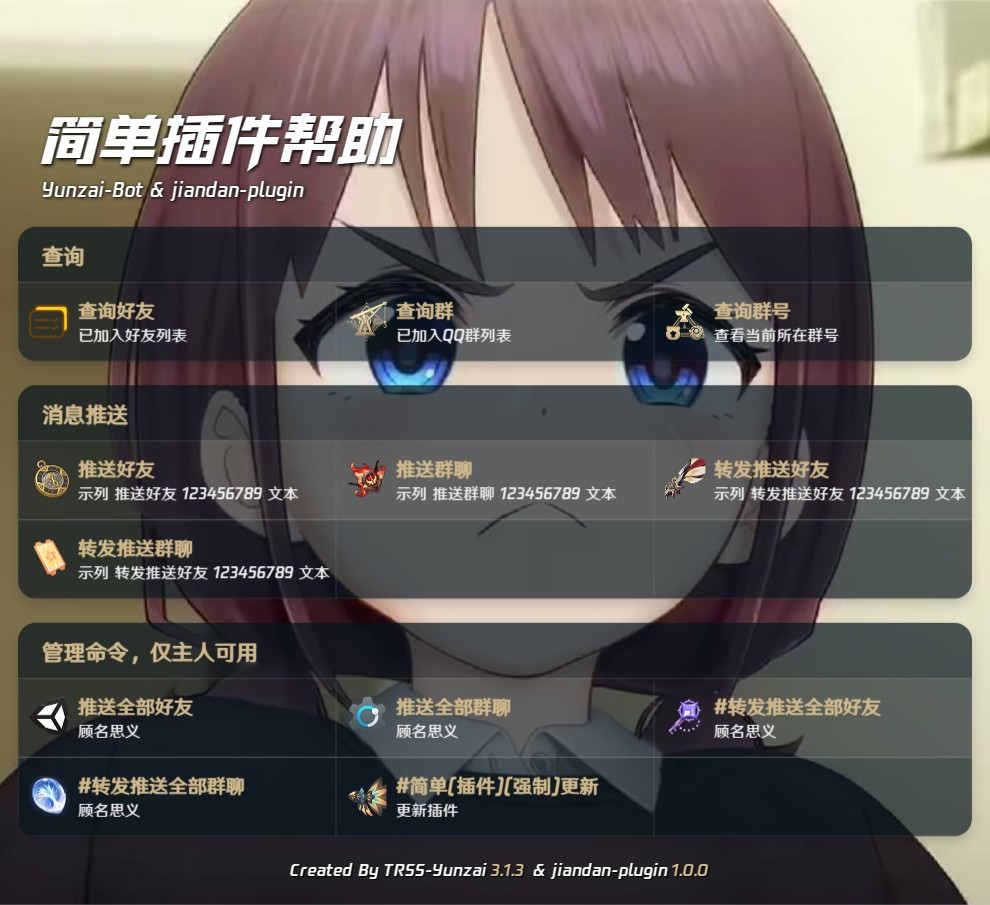

<div style="display: flex; align-items: center; justify-content: center;">
  
  <div>
    <div align="center">jiandan-plugin</div>
    <p align="center">简单插件</p>
  </div>
  
</div>>


## 功能

---

- 查询

- [x] 今日运势
- [x] 今日CP

---

- 联系

- [x] 联系主人
---

- 查询

- [x] 查询好友
- [x] 查询群
- [x] 查询群号

---

- 消息推送

- [x] 推送好友
- [x] 推送群聊
- [x] 转发推送好友
- [x] 转发推送群聊
- [x] 推送全部好友
- [x] 推送全部群聊
- [x] 转发推送全部群聊
- [x] 转发推送全部群聊

---

## 安装与更新

### `Yunzai-Bot`

#### 使用`Github`

```bash
git clone --depth=1 https://github.com/dmmdekkd/jiandan-plugin.git ./plugins/jiandan-plugin
```

#### 使用`Github`镜像

```bash
git clone --depth=1 https://ghfast.top/https://github.com/dmmdekkd/jiandan-plugin.git ./plugins/jiandan-plugin
```
#### 使用`gitee`镜像

```bash
git clone --depth=1 https://gitee.com/qianzhi11_admin/jiandan-plugin.git ./plugins/jiandan-plugin
```

## 帮助图



## 联系

- QQ群  [317849294](http://qm.qq.com/cgi-bin/qm/qr?_wv=1027&k=fhfLfMY0RjF8DyYJdVcHHtvxkzOODTM4&authKey=cFK9hixEIU57AacxLhwnU9%2F6%2Fr26dumlxVO4%2FjHEGRjWWRV6s%2FSwulVtuDkEGHzI&noverify=0&group_code=317849294)